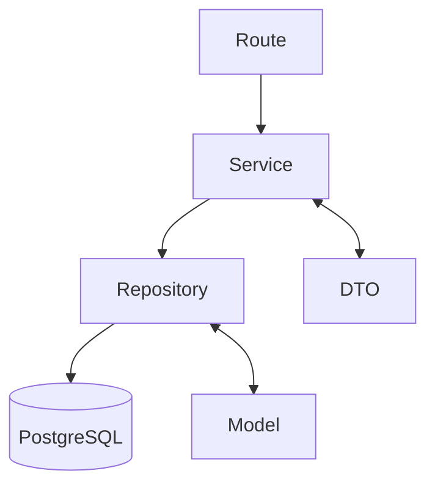

## About Chokotto Memo
**「冷蔵庫へ貼り付ける付箋の感覚を、デジタルへ。」**  
**"Bringing the feeling of sticky notes on your refrigerator into the digital world."**

「あとでやること」  
「ちょっとだけ覚えておきたいこと」

そんな小さなメモを、あなたは付箋へ書き残していませんか？

でも、付箋は増えるほど散らかり、必要なメモが埋もれてしまいます。

ちょこっとメモは、“冷蔵庫に貼る付箋” のような感覚で、  
気軽にメモを残せるシンプルなWebアプリです。

内容、期限、色を選んで、あなたの毎日を少しだけ整理してみませんか？

---

Have you ever quickly written something down on a sticky note  
when you wanted to remember a small task or idea?

Sticky notes are simple and convenient, but as they pile up,  
they become messy and difficult to manage.

Chokotto Memo is a simple web application designed for managing  
small and casual notes you want to keep around for just a little while.

Choose your memo content, set an expiration date, pick a sticky note color,  
and make your everyday life a little more organized and enjoyable.

---

## Tech Stack

### Backend
- Python
- Flask
- SQLAlchemy

### Frontend
- HTML
- CSS
- JavaScript
- IndexedDB
- Service Worker (PWA)

### Database
- PostgreSQL

---

## Architecture

Chokotto Memo follows a layered architecture based on the Repository Pattern.

- Routes
- Service
- Repository
- DTO
- Model

## Features

- Sticky note inspired UI
- Flip animation interaction
- Expiration based memo management
- Simple and lightweight experience
- Offline support (PWA)
- Local storage with IndexedDB

---

## Why Chokotto Memo?

Chokotto Memo focuses on small and temporary notes,  
not heavy task management systems.

It is designed to feel simple, lightweight, and casual —  
just like placing a sticky note on your refrigerator.

## Demo

Try Chokotto Memo here:

🌐 [Live Demo](https://my-note-wst1.onrender.com)

## License

See the [LICENSE](LICENSE) file for details.